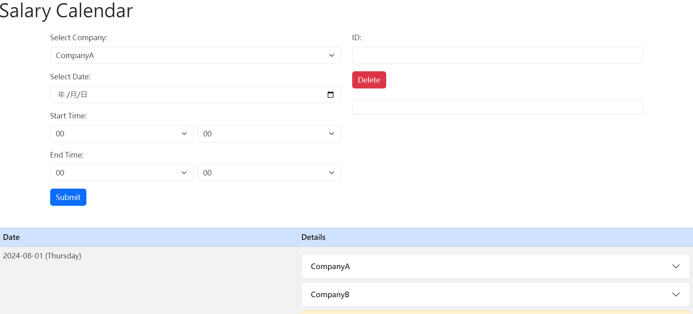
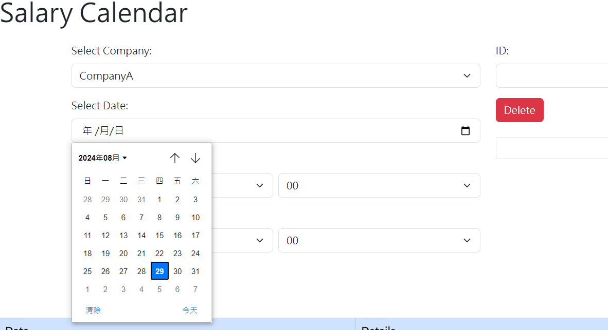
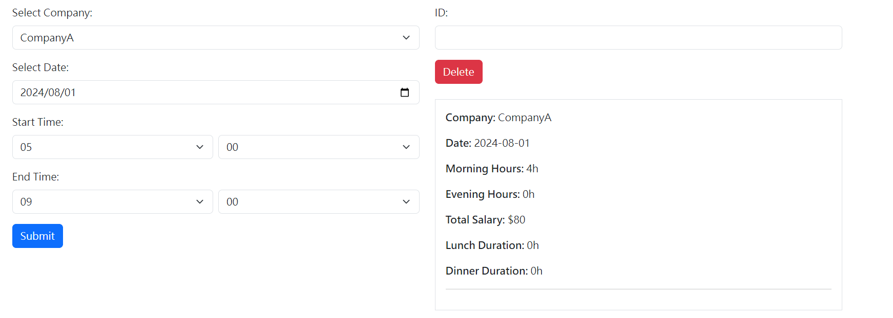
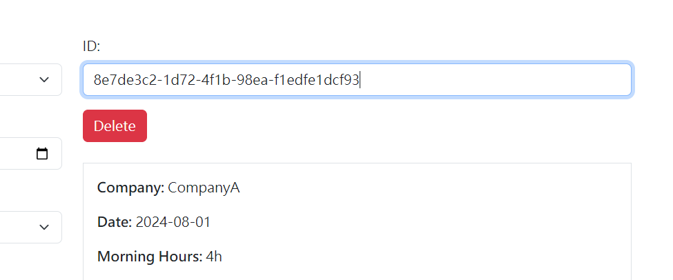
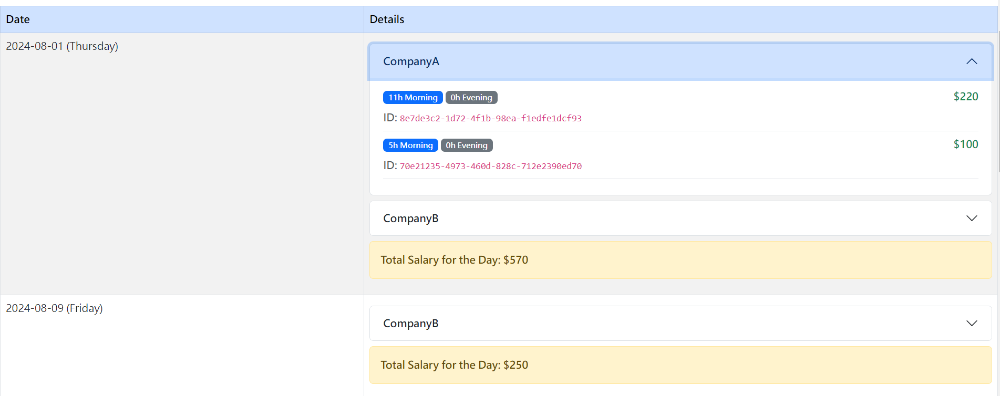
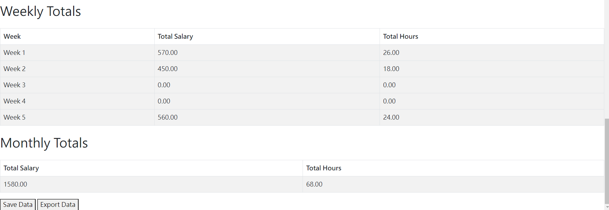

# Lily Calendar

## 使用說明

### 安裝與啟動

1. **安裝 Flask**：
   ```bash
   pip install flask
   ```

2. **克隆倉庫**：
    ```bash
   git clone <repository-url>
   ```

3. **進入專案目錄**：
    ```bash
   cd lily-calendar
   ```

4. **啟動應用程序**：
    ```bash
   python ./start.py
   ```

5. **打開瀏覽器**，訪問 http://127.0.0.1:5000 開始使用。

### 客製化
To add or modify company information, edit the static/company_info.json file. You will see content like the following:

```json

{
    "CompanyB": {
        "lunch_start": "11:00",
        "lunch_end": "12:00",
        "dinner_start": "17:00",
        "dinner_end": "18:00",
        "morning_rate": 25,
        "evening_rate": 35
    }
}
```
You can change the company name, lunch and dinner start and end times, as well as morning and evening shift rates (evening shifts start after dinner).

### 開始使用

1. **開始頁面**：
   
   - Select the company from the "Select Company" dropdown menu.
   - Enter the date and start/end times
   
   - Click "Submit" to add the item to the calendar.
   - The calendar on the right will show the newly added item, allowing you to verify the information.
   
   - You can delete specific items by entering their ID.
    

2. **日曆操作**：
    
   - In the calendar, entries for each company can be folded or expanded.
   - View the salary for each item and the daily salary.
   - Check the working hours for morning and evening shifts.

3. **計算週薪和月薪**：
   
   - To calculate the salary, click "Save" to save the newly added items (data will be exported to static/data.json).
   - You can also choose to download the data.json file.
   - After clicking "Save," the system will automatically refresh and calculate the weekly and monthly salary.

# THK
