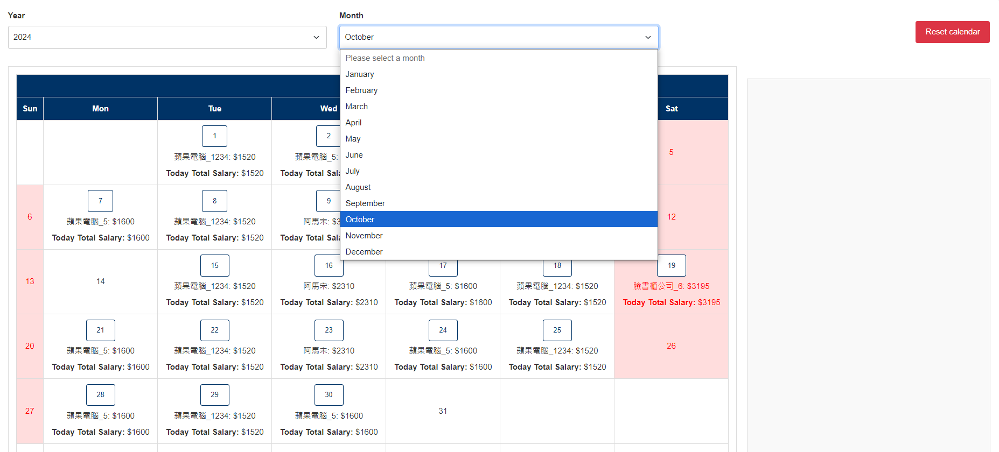

# Lily Calendar

## 使用說明

### 特色
* 簡潔、方便以及快速試算薪水。
* 設定好公司訊息之後只需要輸入你上下班的時間就幫你計算
    1. 每周薪水
    2. 每個月薪水/工時。
* 具有存檔跟讀檔功能。可以將安排好的工作內容匯出以及匯入，不怕遺失。藉由匯入可在不同裝置上繼續編輯
* 直覺化的月曆顯示，可在月曆上刪除修改
* 選擇年月之後可以及時運算當月工時跟薪水

### 安裝與啟動
中文版
1. **安裝 Flask**：
   ```bash
   pip install flask
   ```

2. **git clone 這 repo**：
    ```bash
   git clone https://github.com/judadao/Lily-calendar.git
   ```

3. **進入專案目錄**：
    ```bash
   cd Lily-calendar
   ```

4. **啟動**：
    ```bash
   python ./start.py
   ```

5. **打開瀏覽器**，訪問 http://127.0.0.1:5000 開始使用。


### 設定公司


* 在使用之前先設定兼職公司的資訊


* 新增公司

新增公司的話可以依據公司的狀況先做勾選。勾選後會自動移除以及生成需要填寫的表格(會自動幫您隱藏不需要填寫的欄位)
    *   有三個項目必須要先判斷是否需要勾選
        * 是否有早班晚班的差別
        * 是否需要扣除午休時間
        * 是否需要扣除晚餐時間
    * 根據勾選的結果會有幾種欄位可能需要輸入(不用填的話會自動消失)
        * 午餐時間開始以及結束
        * 晚餐時間開始以及結束 
        * 晚班開始的時間
    * 一定需要填的
        * 公司名字
        * 早班以及晚班的薪水(若沒有晚班，晚班薪水跟早班薪水填一樣即可)
* 修改公司資料

    
* 可在清單直接點選刪除鍵刪除資料


### 開始使用

1. **開始頁面**：


   - 從"Select company"選擇設定好的公司
   - 輸入日期以及時間
   - 點擊submit後送出，並且會將剛剛新增的內容細節顯示在右側的位置

2. **月曆操作**：

   - 月曆上會立即顯示，剛剛新增的物件。並且月曆上會顯示當天兼職公司的時薪。
   - 你可以點擊該物件，會顯示該物件ID以及薪水，然後會有刪除鍵可以將物件直接從月曆上移除
   - 可以選月曆右上方Clear 按鍵清除月曆內的資料

3. **計算週薪和月薪**：
   
   - 當上方月曆選擇年月之後，就會及時運算該年該月的周薪以及月薪還有當月工時

4. 資料管理

    - 可以將目前修改內容儲存起來
    - 可將儲存的內容匯出，如果之後在不同裝置就可以匯入繼續編輯 
